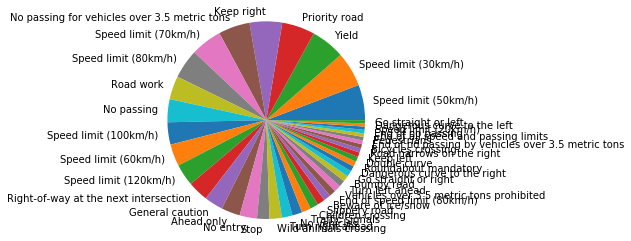
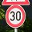
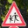
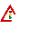

# Project: Traffic Sign Recognition

[](http://www.udacity.com/drive)

## Overview

In this project, a convolutional neural network is used to classify traffic signs. It is trained and validated so it can classify traffic sign images using the [German Traffic Sign Dataset](http://benchmark.ini.rub.de/?section=gtsrb&subsection=dataset). After the model was trained, the model was tried out on images of German traffic signs that were found on the web.

### Build a Traffic Sign Recognition Project

The goals / steps of this project are the following:

* Load the data set (see below for links to the project data set)
* Explore, summarize and visualize the data set
* Design, train and test a model architecture
* Use the model to make predictions on new images
* Analyze the softmax probabilities of the new images
* Summarize the results with a written report

## Rubric Points

### Here the [rubric points](https://review.udacity.com/#!/rubrics/481/view) are considered individually and described how each point is addressed in the implementation

---

You're reading it! and here is a link to my [project code](https://github.com/OidaTiftla/CarND-Traffic-Sign-Classifier-P2/blob/master/Traffic_Sign_Classifier.ipynb)

### Dataset Summary & Exploration

#### 1. Provide a basic summary of the data set. In the code, the analysis should be done using python, numpy and/or pandas methods rather than hardcoding results manually

I used the pandas library to calculate summary statistics of the traffic
signs data set:

* The size of training set is ```34799```
* The size of the validation set is ```4410```
* The size of test set is ```12630```
* The shape of a traffic sign image is ```(32, 32, 3)```
* The number of unique classes/labels in the data set is ```43```

#### 2. Include an exploratory visualization of the dataset

Here is an exploratory visualization of the data set. It is a pie chart showing how the proportion between the samples of the different classes is.



### Design and Test a Model Architecture

#### 1. Pre-process the Data Set

First the number of training samples is increased using augmentation.
Each sample has five representations in the resulting training set, with five different rotation angles: ```[-10, -5, 0, 5, 10]``` degree.
A greater test set improved the neural network in the first epoch from about ```83%``` to about ```93%``` accuracy.

Next the pixel values are normalized, so the neural network has input values from ```-1.0``` to ```+1.0```.
The normalization formula is: ```x_new = (x_old - 128.0) / 128.0```.

Because of the satisfying performance of the neural network no further preprocessing like histogram normalization or color space transformation were tested.

Afterwards all samples get shuffled.

After pre-processing:

* The size of training set is ```173995```
* The size of the validation set is ```4410```
* The size of test set is ```12630```

#### 2. Model Architecture

The final model architecture is based on the LeNet-5.
The depth of the layers is increased compared to the LeNet-5, because the dropout layers need some more weights, so the neural network can build more than one path to classify an image.

The final model consisted of the following layers:

| Layer           | Description                                 |
| :-------------: | :-----------------------------------------: |
| Input           | 32x32x3 RGB image                           |
| Convolution 5x5 | 1x1 stride, valid padding, outputs 28x28x16 |
| RELU            |                                             |
| Max pooling 2x2 | 2x2 stride, outputs 14x14x16                |
| Dropout         | keep_prop = 0.7 while training              |
| Convolution 5x5 | 1x1 stride, valid padding, outputs 10x10x46 |
| RELU            |                                             |
| Max pooling 2x2 | 2x2 stride, outputs 5x5x46                  |
| Dropout         | keep_prop = 0.7 while training              |
| Flatten         | outputs 1150                                |
| Fully connected | outputs 820                                 |
| RELU            |                                             |
| Dropout         | keep_prop = 0.7 while training              |
| Fully connected | outputs 564                                 |
| RELU            |                                             |
| Dropout         | keep_prop = 0.7 while training              |
| Fully connected | outputs 43                                  |
| Softmax         |                                             |

#### 3. Train, Validate and Test the Model

To train the model, a cross entropy was calculated on the softmax layer.
The cross entropy's mean is passed to the optimizer as the loss operation.
To optimize the model the ```AdamOptimizer``` is used.
While training a batch size of ```128``` is used, because doubling the value decreased the accuracy of the neural network drastically while consuming more RAM.
The model was trained completely on the CPU.
Therefore the number of epochs was tried to decrease, while increasing the performance of the network.
The learing rate is set to ```0.001```.
The dropout layer kept ```70%``` while training.
Increasing the value decreased the test accuracy and decreasing the keep probability reduced the validation accuracy (the network needs more epochs to reach the same accuracy).
In the end only ```4``` epochs were needed to train the model with a resulting accuracy of about ```95%```.

#### 4. Approach taken for finding a solution and getting the validation set accuracy to be at least 93%

To evaluate the best network architecture and hyperparameters only the first epoch was executed and taken into account to improve the model.

First the architecture was tuned.
The first architecture was LeNet-5.
This architecture had only an accuracy of about ```60%```.
The depth of the layers was then increased and had a high impact on the accuracy.
Adding a dropout layer, to reduce overfitting, only worked if the depth of the layers was great enough, the network is able to build a redundant path for the classifications.

In the second step the dropout layer's keep probability was tuned, so the network learns fast, while also have a great test accuracy.

As the last step the batch size was doubled for one test, but this decreased the model performance to some fraction of the achieved results with the preceding adjustments.
So the batch size was kept at ```128```.

In the end the model needed only ```4``` epochs to reach a satisfying accuracy of about ```95%``` for the validation set as well as for the test set.

The final model results were:

* training set accuracy of ```99.7%```
* validation set accuracy of ```95.1%```
* test set accuracy of ```94.8%```

The LeNet-5 architecture was chosen as a starting point, because it has some convolutional layers and was designed to work on the same size of input images.

If the validation and test accuracy is also quite as high as the training accuracy, the model can be considered to work quite well.
Never the less, at the moment the test set only contains images which contain a sign.
The neural network only needs to classify them.
But if the neural network get an input image without a sign in it, it does not know what to do and tries to classify it as some sign, also if there is no sign at all in the image.
To further improve the network, the model should also be able to predict, wether the image contains a sign or not.
Therefore some images without signs should be included into the dataset.

### Test a Model on New Images

#### 1. Here are five German traffic signs that I found on the web






The first image might be difficult to classify because another sign is partly visible at the top.
The second should be quite easy.
While the third is a bit noisy and does not have a nice color.
The fourth might be difficult because it as some noisy background.
The fifth also has a different background from the other four images.

#### 2. Discuss the model's predictions on these new traffic signs

Here are the results of the prediction:

| Image                                        | Prediction                                   |
| :------------------------------------------: | :------------------------------------------: |
| Speed limit (30km/h)                         | Speed limit (30km/h)                         |
| No passing for vehicles over 3.5 metric tons | No passing for vehicles over 3.5 metric tons |
| Stop                                         | Stop                                         |
| Bumpy road                                   | Bumpy road                                   |
| Children crossing                            | Children crossing                            |

The model was able to correctly guess 5 of the 5 traffic signs, which gives an accuracy of ```100%```.
This compares favorably to the accuracy on the test set of ```95%```.

#### 3. The top 5 softmax probabilities for each prediction

For the five images, the model is relatively sure (probability of 1.000).
The top five soft max probabilities were

| Probability | Prediction           |
| :---------: | :------------------: |
| 1.000       | Stop                 |
| 0.000       | Speed limit (80km/h) |
| 0.000       | Speed limit (60km/h) |
| 0.000       | Bicycles crossing    |
| 0.000       | No entry             |

| Probability | Prediction           |
| :---------: | :------------------: |
| 1.000       | Speed limit (30km/h) |
| 0.000       | Speed limit (50km/h) |
| 0.000       | Speed limit (80km/h) |
| 0.000       | Speed limit (70km/h) |
| 0.000       | Speed limit (20km/h) |

| Probability | Prediction                                         |
| :---------: | :------------------------------------------------: |
| 1.000       | No passing for vehicles over 3.5 metric tons       |
| 0.000       | End of no passing by vehicles over 3.5 metric tons |
| 0.000       | No passing                                         |
| 0.000       | Priority road                                      |
| 0.000       | Ahead only                                         |

| Probability | Prediction        |
| :---------: | :---------------: |
| 1.000       | Bumpy road        |
| 0.000       | Children crossing |
| 0.000       | Bicycles crossing |
| 0.000       | Traffic signals   |
| 0.000       | No vehicles       |

| Probability | Prediction                   |
| :---------: | :--------------------------: |
| 1.000       | Children crossing            |
| 0.000       | Dangerous curve to the right |
| 0.000       | Slippery road                |
| 0.000       | Ahead only                   |
| 0.000       | Road narrows on the right    |

Just to challenge the neural network, there were some other images tested.
One contains three signs in one image, the other three images have only one sign, but with a scale factor of about ```0.6```.
In two of the last images there are even some parts of the sign hidden, so the signs are not completely visible.





Now the neural network was not able to predict the signs at all.
Look at the top 5 softmax probabilities:

It should be a ```Priority road```, ```Traffic signals``` and ```Roundabout mandatory```, but the softmax probabilities are:
| Probability | Prediction            |
| :---------: | :-------------------: |
| 0.857       | Speed limit (30km/h)  |
| 0.070       | Wild animals crossing |
| 0.067       | Speed limit (20km/h)  |
| 0.003       | Road work             |
| 0.001       | Double curve          |

It should be a ```Priority road```, but the softmax probabilities are:
| Probability | Prediction           |
| :---------: | :------------------: |
| 0.383       | Yield                |
| 0.159       | Speed limit (60km/h) |
| 0.131       | Priority road        |
| 0.125       | No vehicles          |
| 0.053       | Stop                 |

It should be a ```Traffic signals```, but the softmax probabilities are:
| Probability | Prediction            |
| :---------: | :-------------------: |
| 0.907       | Speed limit (20km/h)  |
| 0.093       | Speed limit (30km/h)  |
| 0.000       | Road work             |
| 0.000       | Wild animals crossing |
| 0.000       | Speed limit (50km/h)  |

It should be a ```Roundabout mandatory```, but the softmax probabilities are:
| Probability | Prediction                               |
| :---------: | :--------------------------------------: |
| 0.583       | Vehicles over 3.5 metric tons prohibited |
| 0.154       | Right-of-way at the next intersection    |
| 0.087       | Beware of ice/snow                       |
| 0.046       | Children crossing                        |
| 0.024       | Road work                                |

It shows, that a further improvement of the dataset is needed:

* include images with resized signs, and move the location of the signs inside the image
* include images with only partly visible signs, and combine it with all the other augmentations

## To meet specifications, the project will require submitting three files

* [x] the Ipython notebook with the code
* [x] the code exported as an html file
* [ ] a writeup report either as a markdown or pdf file

## Creating a Great Writeup

A great writeup should include the [rubric points](https://review.udacity.com/#!/rubrics/481/view) as well as your description of how you addressed each point.  You should include a detailed description of the code used in each step (with line-number references and code snippets where necessary), and links to other supporting documents or external references.  You should include images in your writeup to demonstrate how your code works with examples.

All that said, please be concise!  We're not looking for you to write a book here, just a brief description of how you passed each rubric point, and references to the relevant code :).

## Dependencies

This lab requires:

* [CarND Term1 Starter Kit](https://github.com/udacity/CarND-Term1-Starter-Kit)

The lab environment can be created with CarND Term1 Starter Kit. Click [here](https://github.com/udacity/CarND-Term1-Starter-Kit/blob/master/README.md) for the details.

## Dataset and Repository

1. [Download the data set](https://s3-us-west-1.amazonaws.com/udacity-selfdrivingcar/traffic-signs-data.zip). This is a pickled dataset in which we've already resized the images to 32x32. It contains a training, validation and test set.
2. Clone the project, which contains the Ipython notebook.
    ```sh
    git clone https://github.com/udacity/CarND-Traffic-Sign-Classifier-Project
    cd CarND-Traffic-Sign-Classifier-Project
    jupyter notebook Traffic_Sign_Classifier.ipynb
    ```
